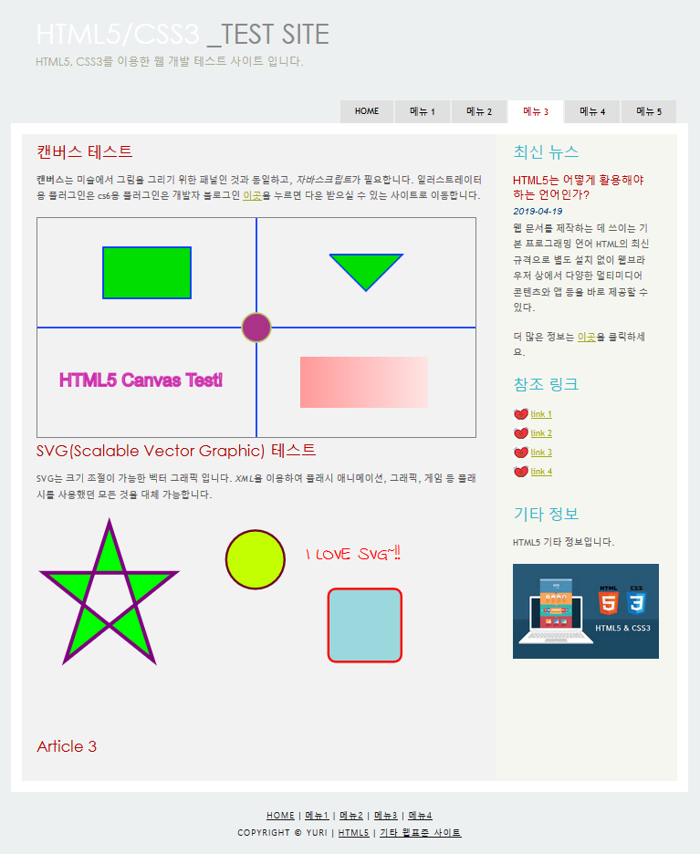
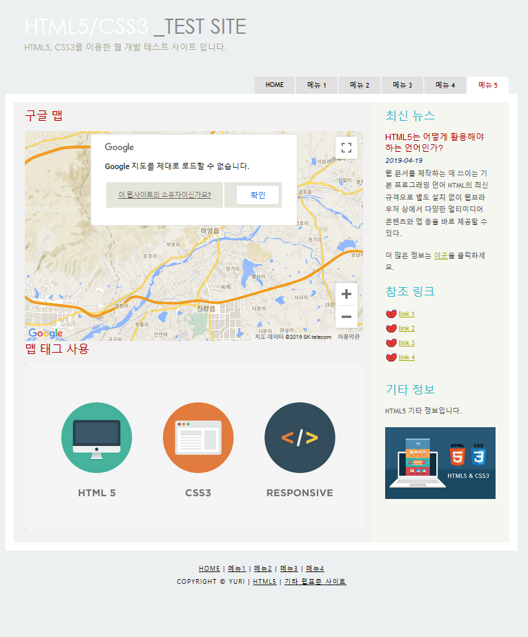
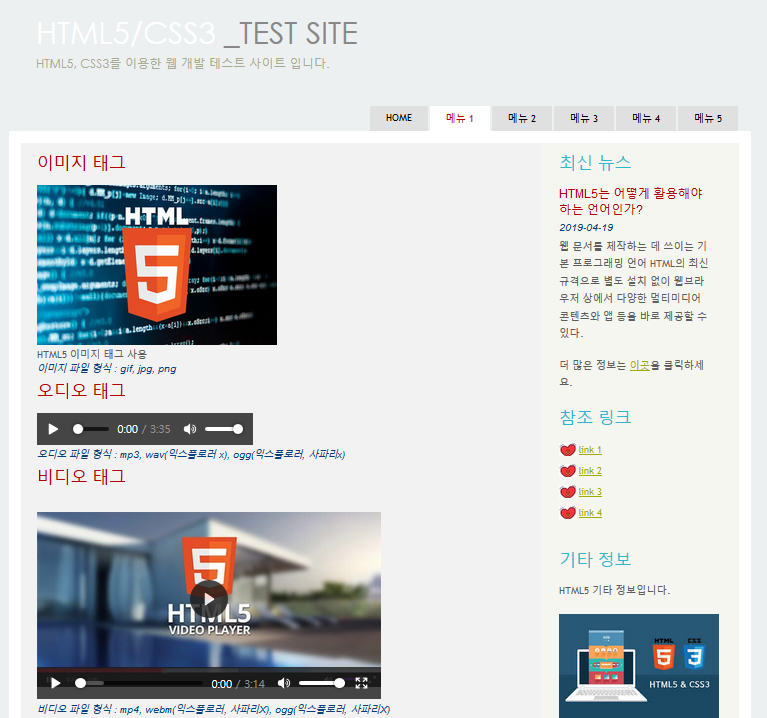
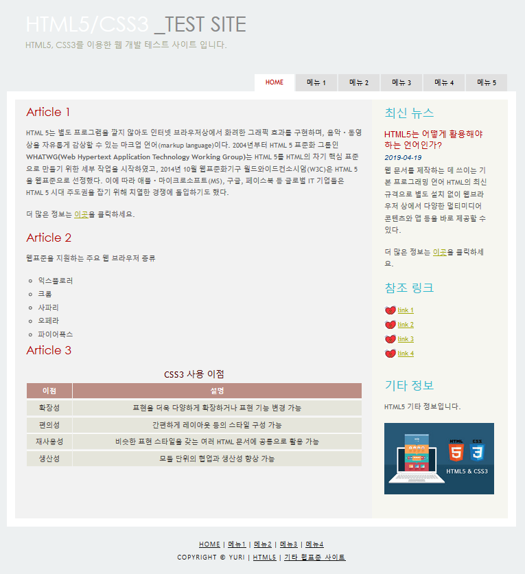
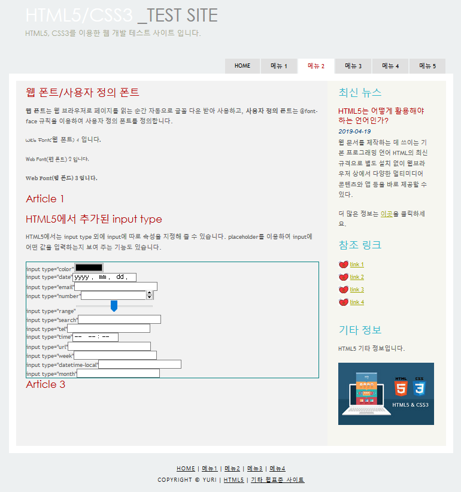
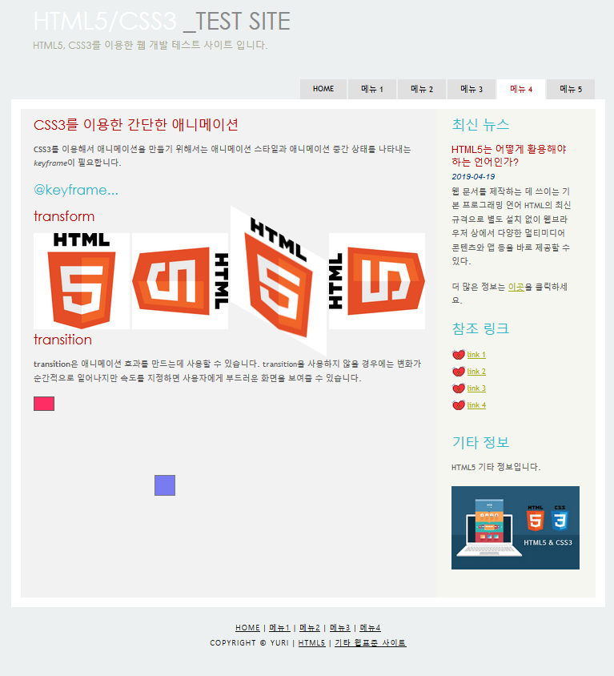

# HTML/CSS를 활용한 WEB Page

## 1. 개요

HTML/CSS 를 활용한 WEB PAGE 입니다.
맵태그, CSS 애니메이션, SVG 등 HTML과 CSS의 다양한 기능을 이해하고 숙지하기 위한 프로젝트였습니다.

 
 

## 2. 사용 언어 및 도구

- HTML
- CSS
- eclipse

## 3. 실행 이미지

## 4. 보안해야할 점

- HTML/CSS의 기능에만 중점을 뒀기 때문에 내용에 알맹이가 없습니다.
